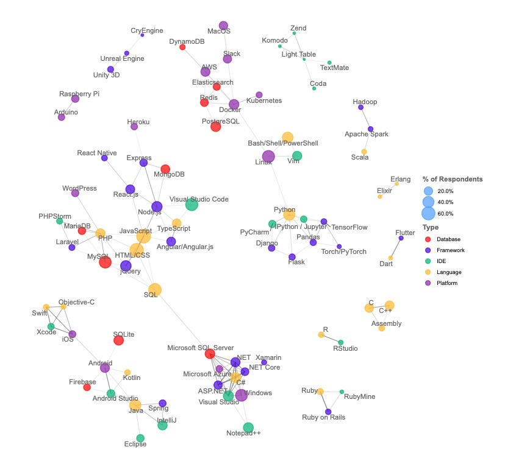

# 深度剖析 GO 为何火热

## 为什么要学习 GO 语言
```
GO 是互联网时代的 C 语言 by 许式伟 
```
1. 天生支持高并发，goroutine, channel, netpoll

2. 工程哲学，简约，非学术语言。关键字 25 个，想比 c 语言 32, java 53, c++ 62 ...
```
package import go goto defer return var const type  func map chan interface struct range select for continue break switch case default fallthrough if  else
```

3. 语法简单，[少即是多](https://commandcenter.blogspot.com/2012/06/less-is-exponentially-more.html)，学习曲线平坦
4. 作者 Robert Griesemer、Rob Pike、Ken Thompson， 大牛云集，质量得以保证
5. 静态，强一致类型语言，开发效率高兼具线上运行稳定安全

## 语言方面的对比 优点
开宗明义，莫要唯语言论，没有最好，只有适合
### 从小处看工程哲学
```c
# cat test.c
#include <stdio.h>

int main(){
	int a;
	printf("value: %d, sizeof: %ld\n", a, sizeof(a));
	return 0;
}
# gcc test.c && ./a.out
value: 319529014, sizeof: 4
```
```go
# cat test.go
package main

import "fmt"
import "unsafe"

func main(){
	var a int
	fmt.Printf("value: %d, sizeof: %d\n", a, unsafe.Sizeof(a))
}
# go run test.go
value: 0, sizeof: 8
```
分析：大学时代，老师教我们 int 是四字节，有符号最大 21 亿，无符号 42 亿。如果 c 语言中一个变量未初始化，那么值可能是随机的， 因为创建局部变量只是 sp 指针向下移动而己。但，现在都 9012 年了，64 位系统己成主流，不必在按位去使用内存，所以 go 语言默认 64 位的 int 就是 8 字节大小。创建变量时，go 也会直接初始化成零值，防止不必要的问题，从实践中来到实践中去。

```c
int binary_search(int * list,int len,int target){
    int low = 0;
    int hight = len-1;
    int middle;
    while(low <= hight){
        middle = (low + hight)/2; // mid = low - (low-hight)/2
        if(list[middle] = target)
        {
            return list[middle];
        }
        else if(list[middle] > target)
        {
            hight = middle -1;
        }
        else if(list[middle] < target)
        {
            low = middle + 1;
        }
    }
    return -1;
}
```
分析：这是 c 语言写的二分查找算法，在很长一段时间里都是不能正确工作，原因就在于 mid 求值可能会溢出

### 垃圾回收，不用关心内存分配与回收
```go
package main

import "fmt"

func genSlice() []int{
	arr:=make([]int, 100)
	for i:=0;i<len(arr);i++{
		arr[i]=i+100
	}
	return arr
}

func main(){
	var a int
	fmt.Println(a)
	arr := genSlice()
	fmt.Println(arr[10])
}

$ go build -gcflags='-m' test.go
# command-line-arguments
./test.go:15:13: inlining call to fmt.Println
./test.go:17:13: inlining call to fmt.Println
./test.go:6:11: make([]int, 100) escapes to heap
./test.go:15:13: a escapes to heap // 请看这里，变量 a 逃逸到堆
./test.go:15:13: io.Writer(os.Stdout) escapes to heap
./test.go:17:13: io.Writer(os.Stdout) escapes to heap
./test.go:17:17: arr[10] escapes to heap
./test.go:15:13: main []interface {} literal does not escape
./test.go:17:13: main []interface {} literal does not escape
<autogenerated>:1: os.(*File).close .this does not escape
```
分析：`genSlice` 分配了一块内存，初始化后返回给调用者，使用后无需主动释放，由 GC 垃圾回收。严格来讲，使用者无法决定某变量在堆还是栈上分配，也可以说 GO 淡化了堆栈的概念与界线。

```c
static int __netif_hw_addr_add(struct netif_hw_addr_list *list,
                               const struct ether_addr *addr)
{
    struct netif_hw_addr *ha;

    list_for_each_entry(ha, &list->addrs, list) {
        if (eth_addr_equal(&ha->addr, addr)) {
            rte_atomic32_inc(&ha->refcnt);
            return EDPVS_OK;
        }
    }

    ha = rte_zmalloc(NULL, sizeof(*ha), 0);
    if (!ha)
        return EDPVS_NOMEM;

    ether_addr_copy(addr, &ha->addr);
    rte_atomic32_set(&ha->refcnt, 1);
    ha->sync_cnt = 0;
    list_add_tail(&ha->list, &list->addrs);
    list->count++;

    return EDPVS_OK;
}
```
分析：底层开发者，上手一段 c/c++ 代码，能区分变量分配在堆或是栈上，是一种常识与基本功。但是广大的 php, python 动态语言开发者可能就没那么容易。
### defer 与 RAII
```go
func (o *Once) Do(f func()) {
	if atomic.LoadUint32(&o.done) == 1 {
		return
	}

	o.m.Lock()
	defer o.m.Unlock()
	if o.done == 0 {
		defer atomic.StoreUint32(&o.done, 1)
		f()
	}
}
```
```c++
class DBCon{
public:
  DBCon() { 
    handle = fooOpenDBConnection();
  }
  ~DBCon() {
    int err = fooCloseDBConnection();
    if(err){
      if(err == E_fooConnectionDropped){
        // do nothing.  must have timed out
      } else if(fooIsCriticalError(err)){
        // critical errors aren't recoverable.  log, save 
        //  restart information, and die
        std::clog << "critical DB error: " << err << "\n";
        save_recovery_information();
        std::terminate();
      } else {
        // log, in case we need to gather this info in the future,
        //  but continue normally.
        std::clog << "non-critical DB error: " << err << "\n";
      }
    }
    // done!
  }
};
```
分析：RAII 在 c++ 项目中应用广泛，一般用于获取锁或是竞争资源，退出作用域时自动释放。GO 常用 defer 来实现此功能，在函数返回前，按 FILO 的顺序执行注册的 defer 函数。

### GMP 并发模型
```go
func OpenDB(c driver.Connector) *DB {
	ctx, cancel := context.WithCancel(context.Background())
	db := &DB{
		connector:    c,
		openerCh:     make(chan struct{}, connectionRequestQueueSize),
		resetterCh:   make(chan *driverConn, 50),
		lastPut:      make(map[*driverConn]string),
		connRequests: make(map[uint64]chan connRequest),
		stop:         cancel,
	}

	go db.connectionOpener(ctx)
	go db.connectionResetter(ctx)

	return db
}
```
分析：上面代码来自标准库代码，打开 DB 后开启两个 goroutine 异步做其它辅助功能。开启协程如此方便，代价非常低非常轻量。写过 java  会看到，某个业务模块就得开避一个线程池 `FixedThreadPool`, 这一堆池那一堆池。对于 c/c++ 项目，一般使用 epoll, 然后多进程监听同一端口，比如 Nginx. 但是业务逻辑纯异步驱动的，熟悉 redis 的都知道，一个请求的完整流程，是分割在各处的回调函数，非常不直观。而 GO 写出来的代码，纯顺序编程，遇到阻塞式调用也不用提心。

关于 [GMP](https://tonybai.com/2017/06/23/an-intro-about-goroutine-scheduler/) 模型网上有很多讨论，推荐看这个博客。可以简单理解为 GO 自己封装的线程池，G 代表 goroutine 执行体描述，很轻量，自带用户层的 2k 大小栈，可以拥有百万级别的 goroutine. M 代表底层线程，当前版本可以开启至多 1w 个物理线程，对于不活跃线程目前不会回收释放。P 代表逻辑并发，也就是 GOMAXCPU 个数，可动态调整，但一般都是 cpu 个数。

* go func() 只是将 func 打包成 G，提交到待运行队列中，具体何时执行，由 runtime 调度
* P 拥有本地 G 队列，优先运行本地 G，本地没有时执行全局队列，或是 steal 偷其它 P 的数据
* P 只是逻辑执行器，执行时必须绑定一个空闲的 M，PM 对可以运行多个 G，如果处于阻塞状态，那么 PM 分离，P 重新获取空闲 M 去运行新的 G
* 处于阻塞状态的 G，收到数据后被唤醒，置于 P 的待运行 G 队列中，等待调度

### CSP 交互模型
大佬 robe pike 写过一篇文章 [concurrency-is-not-parallelism](https://talks.golang.org/2012/waza.slide#50), 专门介绍并发与并行的关系，其中就涉及到使用 channel 来消息通信
```go
func (db *DB) connectionResetter(ctx context.Context) {
	for {
		select {
		case <-ctx.Done():
			close(db.resetterCh)
			for dc := range db.resetterCh {
				dc.Unlock()
			}
			return
		case dc := <-db.resetterCh:
			dc.resetSession(ctx)
		}
	}
}

func (db *DB) connectionOpener(ctx context.Context) {
	for {
		select {
		case <-ctx.Done():
			return
		case <-db.openerCh:
			db.openNewConnection(ctx)
		}
	}
}
```
分析：CSP（Communicating Sequential Process）一种描述并发系统交互模式的形式化语言，其交互模式是通过channel进行消息传递。GO 语言哲学，Don't communicate by sharing memory, share memory by communicating. 通过 channel 很容易实现消息传递，数据通信，超时退出等等。[channel](https://www.jianshu.com/p/39a3637804bb), goroutine, gc, memory 等等都是完整的 runtime 体系，一环扣一环。

### 接口与组合
```go
// 代理接口，后端可以自定义实现接口即可
type Delegater interface {
	LockWithToken(key, value string, duration int) error
	UnLockWithToken(key, value string, force bool) error
}

type RedisDelegater struct {
	*RedisClient
}

func (r *RedisDelegater) LockWithToken(key, value string, duration int) error {
	conn, err := r.RedisClient.GetConn()
	if err != nil {
		return err
	}
	defer conn.Close()

	ret, err := redis.Int(conn.Do("EVAL", LuaLock, 1, key, value, duration))
	if err != nil {
		return fmt.Errorf("%s %v", LuaLock, err)
	}

	switch ret {
	case 0, 1:
		return nil
	case 2:
		return ErrLockFailed
	}
	return ErrUnknown
}

func (r *RedisDelegater) UnLockWithToken(key, value string, force bool) error {
	conn, err := r.RedisClient.GetConn()
	if err != nil {
		return err
	}
	defer conn.Close()

	var ret int
	if force {
		ret, err = redis.Int(conn.Do("EVAL", LuaUnLockForce, 1, key, value))
	} else {
		ret, err = redis.Int(conn.Do("EVAL", LuaUnLock, 1, key, value))
	}
	if err != nil {
		return err
	}

	// 强制解锁不理会返回值 ret
	if force {
		return nil
	}

	switch ret {
	case 0, 1:
		return nil
	case 2:
		return ErrUnLockFailed
	}
	return ErrUnknown
}
```
分析：[dlock](https://github.com/dongzerun/dlock) 基于 redis 实现的分布式锁，在 GO 语言中只要结构实现了接口中的所有方法，那么就说这个结构体实现某个接口，而不用显示声明。在面向对象编程中，可以这么说：“接口定义了对象的行为”， 那么具体的实现行为就取决于对象了。在Go中，接口是一组方法签名。当一个类型为接口中的所有方法提供定义时，它被称为实现该接口。它与oop非常相似。接口指定类型应具有的方法，类型决定如何实现这些方法。

## 语言方面的对比 缺点
* GC：当前仍然是三色标记算法，毕竟不如 Java 调教的久，可能以后也会变成分代收集。关于 GC 的坑，可以参考我的 [记一次GC引起的问题排查](https://www.jianshu.com/p/0791c35d3609)
* 泛型：主流的有两种泛型实现，c++ 的模版，编绎期实现和 java 系的运行期实现。目前 GO 同一个算法只能手写多份不同类型的代码，虽然 interface{} 一定程度可以代替，但还是挫
* 依赖包：还是不成熟，从最早的 go vendor, godeps 再到 glide，都是实验品，当前官方主推 go module，看看效果吧。

最初 GO 语言的定位是系统编程语言，但是由于 GC 的存在，系统编程仍然是 c/c++ 占主导，甚至不如 Rust. 在大数据和电商领域，由于己经成熟的决解方案，Java 仍是最好的选择。目前 GO 在云领域没有对手，docker, k8s 就是主打产品，在主流互联网公司，GO 一般用于 IO 类型的业务开发，比如滴滴中台。

## 语言生态圈

* [2019 stackoverflow 调查](https://insights.stackoverflow.com/survey/2019)显示，Python 由于 AI 机器学习的加持，持续火热。Java 系在电商及大数据领域，仍然无法撼动。Rust 新兴语言很受重注，尤其是技术范的程序员最喜欢。大家可以自己看看这份调查，很有意思。

* 薪水领域的调查，发现 clojure 居然是最高的，排在第二的就是 GO

* 技术栈方面的图谱如上所示，左下以互联网 web 开发相关 (JavaScript, HTML/CSS, TypeScript, and React.js) 通过 DB 与微软的技术 (with C#, Visual Studio, and .NET Core) 连通，是一块大的技术栈。 一部份是移动互联网以 Java, Kotlin, Android, iOS 为主，一部份是云服务，以 Docker, AWS, K8S 做为主要生态。 当然最重要的大数据生态来自 Scala/Spark/Hadoop. 
* 通过这里可以看过，每种语言都有自己的领域，没有最好，只有更合适


## 分享我的学习路径
### 小白如何入门
相比其它劝退型语言，Rust, Scala, Clojure 等等，GO 学习曲线最为平坦，容易上手也是他的最大优点之一。我也是从小白走过来的，分享几点我的学习方法。

1. 找本比较受欢迎的电子书，强推[雨痕笔记](https://github.com/qyuhen)。学习 GO 基础语法，数据结构，slice, channel, goroutine, map 等等，先夯实基础
2. 找准定位，根据自身职位找相关开源优秀代码学习。可以参考 [awesome-go](https://github.com/go-awesome/awesome-go)，比如 DBA 可以读读 Codis 代码，读读 Redis Go Driver. 还有最近兴起的 gh-ost 等等
3. 最后一定要找机会上手实战，运维同学可以写一些小工具脚本。后端开发者，如果是微服务，完全可以说服领导偿试换新的语言，这里建义有精力可以重写业务模块，然后导流观察性能，用事实说话

4. 阅读相关博客，比如别人走的坑，推荐看 [go中国社区](https://gocn.io/)，至少 astaxie 还在维护

### 老鸟如何进阶
语言进阶很不容易，这里推荐[《Go语言高级编程》](https://github.com/chai2010/advanced-go-programming-book), 很快也会出版纸制书

1. 强烈推荐多接触其它语言，尤其是 c/c++, 多做对比

2. 最重要还是大量的实践，代码写的多了，屎堆的多才能深刻理解工程管理以及规则，这点所有语言通用

3. 寻找优秀开源项目学习源码，推荐先从小项目开始，再逐渐到大项目，学习工程规划，多阅读 issue，如果自己可以提 pr 也可以参与其中

4. 开始阅读 go 源码，推荐先阅读标准库，比如 io, http, net 等等门槛低的，再去阅读 slice, channel, map, string 等数据结构，最后再阅读 runtime 以及汇编

